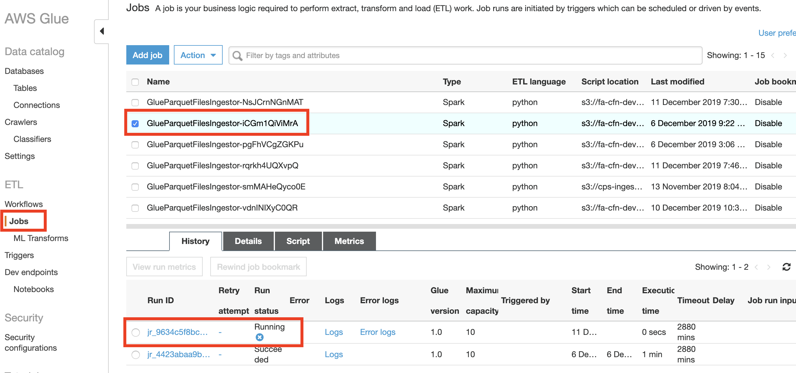
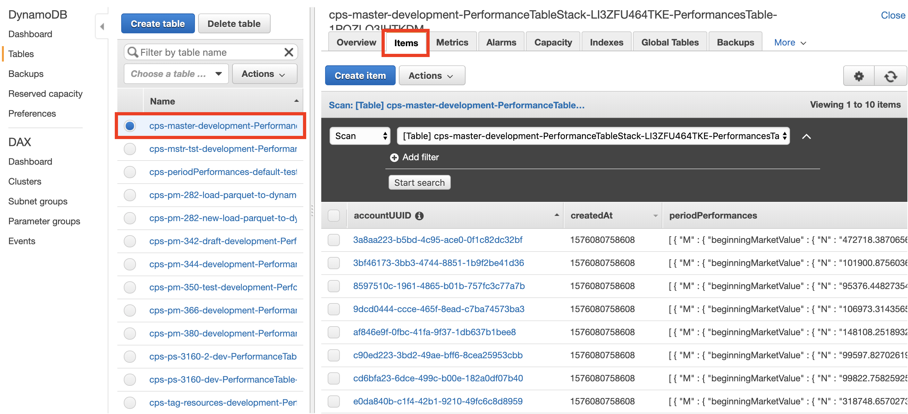
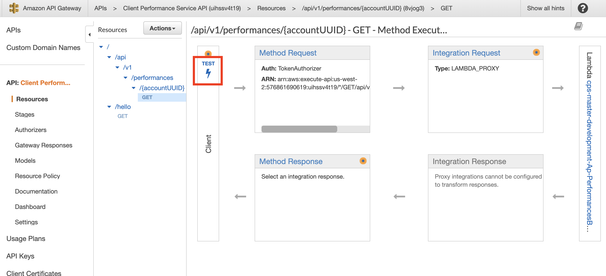
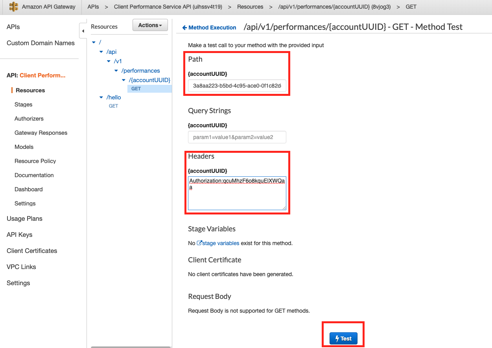
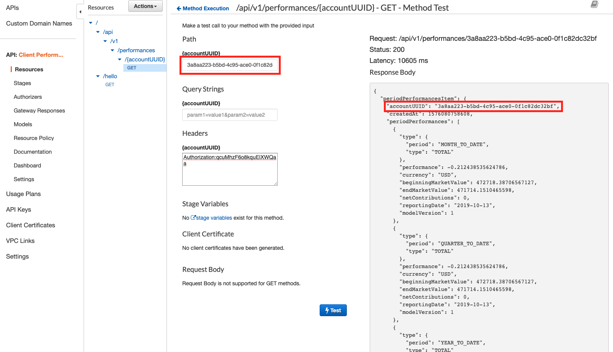

## CPS master development

### Intro

Here is the cicd stack that we deployed our master branch (`Tier` is `development`) to aws: [cps-cicd-master-development](https://us-west-2.console.aws.amazon.com/cloudformation/home?region=us-west-2#/stacks/stackinfo?filteringText=development&filteringStatus=active&viewNested=true&hideStacks=false&stackId=arn%3Aaws%3Acloudformation%3Aus-west-2%3A576861690619%3Astack%2Fcps-cicd-master-development%2F9a798350-184b-11ea-afe7-0a92bf2e649c), it helps us automatically deploy our template [cps-master-development](https://us-west-2.console.aws.amazon.com/cloudformation/home?region=us-west-2#/stacks/stackinfo?filteringText=development&filteringStatus=active&viewNested=true&hideStacks=false&stackId=arn%3Aaws%3Acloudformation%3Aus-west-2%3A576861690619%3Astack%2Fcps-master-development%2Facbe5f80-184c-11ea-b076-02d0bd2cd418), which contains all needed stacks including `PerformanceTableStack`, `TransformIngestorStack`, `ApiGWStack` and `CPSDataBucketStack`

### Workflow

- **Data ingestion workflow** (from parquest format file to ingesting into DynamoDB)
	1. Go to [CPSDataBucket](https://console.aws.amazon.com/s3/buckets/cps-data-master-development-us-west-2/?region=us-west-2), in `tranformed` folder, upload the test parquet file. (We have a test file there, you can delete and reload it, so that s3 bucket can send the file put notification)
	2. After uploading, s3 bucket will send notification to the [ParquetFileIngestorTriggerFunction](https://us-west-2.console.aws.amazon.com/lambda/home?region=us-west-2#/functions/cps-master-development-Tr-ParquetFileIngestorTrigg-1IER5VUUS5Z93?tab=configuration)
	3. Which will start the GlueParquetFilesIngestor job. To view the job status, you can go to [Glue job console](https://us-west-2.console.aws.amazon.com/glue/home?region=us-west-2#etl:tab=jobs), the glue job name is `GlueParquetFilesIngestor-iCGm1QiViMrA` and by clicking it, you should see the run status to be `Running` and then `Succeeded` as follows.
	
	4. After Glue job status shows `Succeeded`, you can go to the [PerformancesTable](https://us-west-2.console.aws.amazon.com/dynamodb/home?region=us-west-2#tables:selected=cps-master-development-PerformanceTableStack-LI3ZFU464TKE-PerformancesTable-1POZLO3IHTKDM;tab=overview), and click on `Items` tab. You should find data has been ingested as follows.
	

- **Retrieving performances data workflow**
	1. Go to [API Gateway](https://us-west-2.console.aws.amazon.com/apigateway/home?region=us-west-2#/apis/uihssv4t19/resources/8vjog3/methods/GET). In this `GET` method, click on the `TEST` right above the lightening icon as follows
	
	2. In the TEST console, input an accountUUID in `Path` field and input `Authorization:qcuMhzF6o8kquElXWQaa` as `auth_token` in `Headers` field. (You can also find this `auth_token` in [SecretsManager](https://us-west-2.console.aws.amazon.com/secretsmanager/home?region=us-west-2#/secret?name=%2Fservice%2FCPS%2Fauthorizer%2Fdev%2Ftoken) by clicking `Retrieve secrete value` in `Secret value` field. The token is manually set for testing now, so I can share it here. Will update token later.)
	3. The TEST console should look like this after inputting accountUUID and auth_token
	
	4. Then click the `Test` button and you should retrieve the performances data for this `accountUUID` as follows.
	
	5. You can also test the API by inputting the following command in terminal (change the `{accountUUID}` part to the one you want to test):
	```bash
	  curl -v --header \
  		"Authorization:qcuMhzF6o8kquElXWQaa" \
	    "https://uihssv4t19.execute-api.us-west-2.amazonaws.com/development/api/v1/performances/{accountUUID}"
	```
	You should get the performances data back as follows:
	