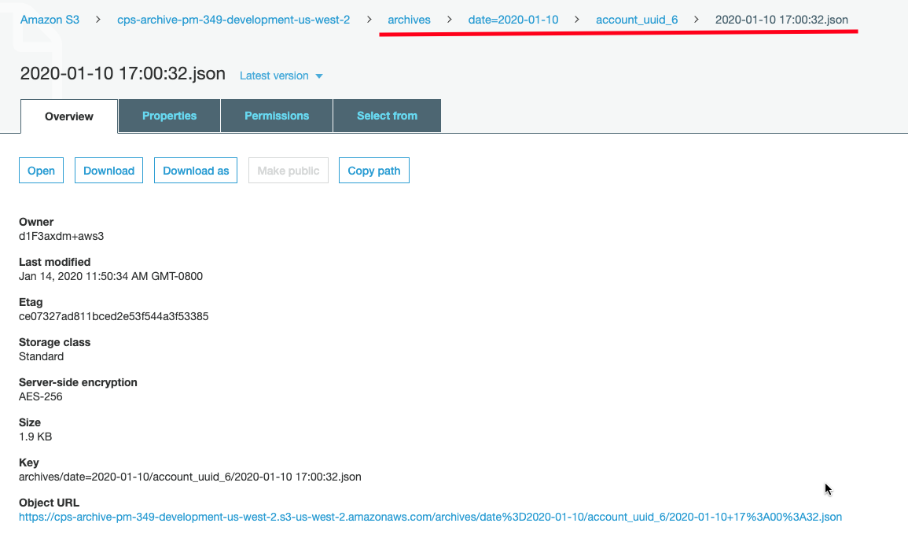
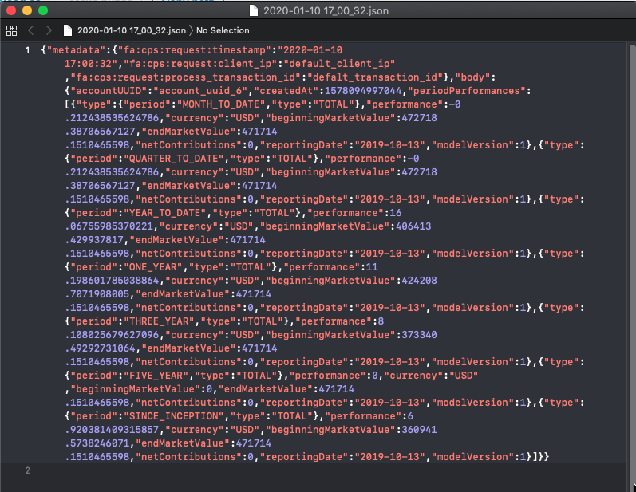

## CPS master development

### Intro

Here is the cicd stack that we deployed our master branch (`Tier` is `development`) to aws: [cps-cicd-master-development](https://us-west-2.console.aws.amazon.com/cloudformation/home?region=us-west-2#/stacks/stackinfo?filteringText=master&filteringStatus=active&viewNested=true&hideStacks=false&stackId=arn%3Aaws%3Acloudformation%3Aus-west-2%3A576861690619%3Astack%2Fcps-master%2Ff9c11320-365d-11ea-a495-06287158ecd0), it helps us automatically deploy our template [cps-master-development](https://us-west-2.console.aws.amazon.com/cloudformation/home?region=us-west-2#/stacks/stackinfo?filteringText=master&filteringStatus=active&viewNested=true&hideStacks=false&stackId=arn%3Aaws%3Acloudformation%3Aus-west-2%3A576861690619%3Astack%2Fcps-master-development%2Ff1acf090-365e-11ea-aa08-0aa27834ab52), which contains all nested stacks including [ServiceStack](https://us-west-2.console.aws.amazon.com/cloudformation/home?region=us-west-2#/stacks/stackinfo?filteringText=master&filteringStatus=active&viewNested=true&hideStacks=false&stackId=arn%3Aaws%3Acloudformation%3Aus-west-2%3A576861690619%3Astack%2Fcps-master-development-ServiceStack-1WVM0TSD6QTT7%2F0ad1dc20-365f-11ea-ade4-0a59d1b75b46) and [IngestionPipelineStack](https://us-west-2.console.aws.amazon.com/cloudformation/home?region=us-west-2#/stacks/stackinfo?filteringText=master&filteringStatus=active&viewNested=true&hideStacks=false&stackId=arn%3Aaws%3Acloudformation%3Aus-west-2%3A576861690619%3Astack%2Fcps-master-development-IngestionPipelineStack-1U4T9Y4D7JS3Q%2F44dabb81-365f-11ea-a466-06bedd0f3972) and also [CPSDataBucket](https://console.aws.amazon.com/s3/buckets/cps-data-master-development-us-west-2/?region=us-west-2), which store all the `raw`, `conformed` and `transformed` data files.

### Workflow

- **Data ingestion workflow** (from parquest format file to ingesting into DynamoDB)
	1. Go to [CPSDataBucket](https://console.aws.amazon.com/s3/buckets/cps-data-master-development-us-west-2/?region=us-west-2), in `tranformed` folder, upload the test parquet file. (We have a test file there, you can delete and reload it, so that s3 bucket can send the file put notification)
	2. After uploading, s3 bucket will send notification to the [ParquetFileIngestorTriggerFunction](https://us-west-2.console.aws.amazon.com/lambda/home?region=us-west-2#/functions/cps-master-development-In-TransformedLambdaFunctio-P44MW7OLQCTR?tab=configuration)
	3. Which will start the GlueParquetFilesIngestor job. To view the job status, you can go to [Glue job console](https://us-west-2.console.aws.amazon.com/glue/home?region=us-west-2#etl:tab=jobs), the glue job name is `TransformedGlueJob-hiEyF3erLb2j` and by clicking it, you should see the run status to be `Running` and then `Succeeded` as follows.
	
	4. After Glue job status shows `Succeeded`, you can go to the [PerformancesTable](https://us-west-2.console.aws.amazon.com/dynamodb/home?region=us-west-2#tables:selected=cps-master-development-ServiceStack-1WVM0TSD6QTT7-PerformancesTable-17N55A4GCM7ZL;tab=items), and click on `Items` tab. You should find data has been ingested as follows.
	

- **Retrieving performances data workflow**
	1. Go to [API Gateway](https://us-west-2.console.aws.amazon.com/apigateway/home?region=us-west-2#/apis/xx8gso90y0/resources/iiiiwd/methods/GET). In this `GET` method, click on the `TEST` right above the lightening icon as follows
	
	2. In the TEST console, input an accountUUID in `Path` field and input `Authorization:2m8zwchcjmuus3gh9du298g3a3i860knp9257xks` as `auth_token` in `Headers` field. (You can also find this `auth_token` in [SecretsManager](https://us-west-2.console.aws.amazon.com/secretsmanager/home?region=us-west-2#/secret?name=%2Fservice%2FCPS%2Fauthorizer%2Fdev%2Ftoken) by clicking `Retrieve secrete value` in `Secret value` field. The token is manually set for testing now, so I can share it here. Will update token later.)
	3. The TEST console should look like this after inputting accountUUID and auth_token
	
	4. Then click the `Test` button and you should retrieve the performances data for this `accountUUID` as follows.
	
	5. You can also test the API by inputting the following command in terminal (change the `{accountUUID}` part to the one you want to test):
	```bash
	  curl -v --header \
  		"Authorization:2m8zwchcjmuus3gh9du298g3a3i860knp9257xks" \
	    "https://xx8gso90y0.execute-api.us-west-2.amazonaws.com/development/api/v1/performances/{accountUUID}"
	```
	You should get the performances data back as follows:
	

- **Archiving process**
	1. Before the API gateway giving back the response data to client, it will push those data to [cps-master-development-PerformancesResponsesSqsQueue](https://console.aws.amazon.com/sqs/home?region=us-west-2) and our [archiver function](https://us-west-2.console.aws.amazon.com/lambda/home?region=us-west-2#functions/cps-master-development-Se-PerformancesArchiverFunc-BAJE2UJ4MLZG) will be triggered to receive messages from SQS queue and archive to [CPSArchiveBucket]()
	2. Go to [CPSArchiveBucket](), you should find the archiving data under the path of `/archives/date=$date/$accountUUID/$timestamp.json` as follows:
	
	3. And the json file should look like this:
	
 
### Test Data Generator

In order to test the whole workflow, we have a `testDataGenerator` module in CPS which can generate realistic looking Raw Env file. Please refer to the [README](https://github.com/FutureAdvisor/CPS/blob/master/testDataGenerator/README.md) file on how to generate testing data. 